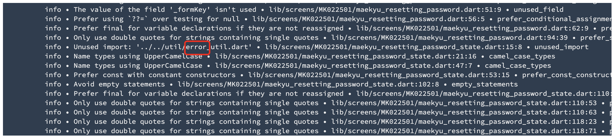
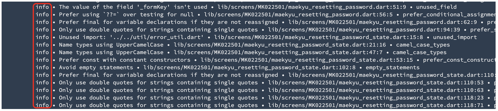

# 新Flutter Analyze

本bitrise stepは`bitrise-steplib/bitrise-step-flutter-analyze` を変更したもので、Flutter projectにおける `flutter analyze` commandで実行される。


## 変更内容

### 1. Bitrise flutter-analyzeの問題点
infoレベル error|warning|info のうちinfoレベルしか存在しない場合でも、出力メッセージに'error' ワードが存在するとerrorありと判定してしまう。



### 2. Bitrise flutter-analyzeの変更
flutter-analyze結果の標準出力行の先頭infoレベル error|warning|info のみでerror有無を判定する。
この変更の有効/無効は引数で指定可能とする。



## 開発環境

### 1. ベンダリング

カスタムステップにおける依存パッケージ管理は依存ライブラリをリポジトリ内に含めるために、以下の何かを利用する。

* Go Module
* dep

#### (1) Go Module
Go Moduleはそのまま使うとvendorディレクトリには入ラナイが、 go mod vendor コマンドを使うとvendorディレクトリを利用してくれる。
そのため、こちらを使い、vendorをコミットすることでカスタムステップを実行することができる。

```
go mod init
go mod vendor
```

#### (2) dep
公式のカスタムステップではdepを使っているケースが多いため、depを使う方法についても記述する。
こちらも使うのは簡単で、以下のコマンドで実行できる。

```
dep init
dep ensure
```

